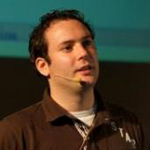
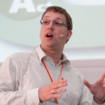
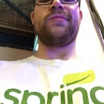
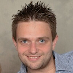

The Flowable Team comprises people who are committed to creating the best Java BPM technology and making it available to everyone through Open Source.
 
 

	<a class="team-member" href="#tijsModal" rel="modal:open">
	   

	</a>

	

	    

	        

	        <h3>Tijs Rademakers</h3>
	        
Project Lead

	    

	    
Tijs is the Flowable project lead at edorasware. He&#39;s been involved in Java, BPM and enterprise integration projects for more than 15 years.
	    Recently his work focused on building the v6 engine and he’s eager to continue evolving the v6 engine in the Flowable project.
	    Tijs is passionate about open source BPM and integration. He&#39;s the author of the <a href="http://manning.com/rademakers2" target="_blank">Activiti in Action</a> and <a href="http://manning.com/rademakers" target="_blank">Open source ESBs in Action</a> Manning books.
	    

	        

	            <a href="https://twitter.com/tijsrademakers" target="_blank"><i class="fa fa-twitter-square fa-lg" aria-hidden="true"></i></a>
	        

	        

	            <a href="https://linkedin.com/in/tijsrademakers" target="_blank"><i class="fa fa-linkedin-square fa-lg" aria-hidden="true"></i></a>
	        

	        

	            <a href="http://bpmn20inaction.blogspot.nl" target="_blank"><i class="fa fa-rss-square fa-lg" aria-hidden="true"></i></a>
	        

	    

	

	
	<a class="team-member" href="#joramModal" rel="modal:open">
	   

	</a>

	

	    

	        

	        <h3>Joram Barrez</h3>
	        
Core Flowable developer

	    

	    
Joram is a Flowable core developer at edorasware with many years experience in open-source software and of building scalable process engines. 
	    He co-founded the Activiti project (on which Flowable is based) and was a core developer for over six years. 
	    When a principal software engineer at Alfresco, he was part of the team that architected and brought the enterprise business process management offerings 
	    successfully to market. Before that he was employed by JBoss/RedHat as part of the jBPM team and started his career as a Java consultant with a focus on BPM.
	    

	        

	            <a href="https://twitter.com/jbarrez" target="_blank"><i class="fa fa-twitter-square fa-lg" aria-hidden="true"></i></a>
	        

	        

	            <a href="https://linkedin.com/in/jorambarrez" target="_blank"><i class="fa fa-linkedin-square fa-lg" aria-hidden="true"></i></a>
	        

	        

	            <a href="http://www.jorambarrez.be/blog" target="_blank"><i class="fa fa-rss-square fa-lg" aria-hidden="true"></i></a>
	        

	    

	

	<a class="team-member" href="#yvoModal" rel="modal:open">
	    

	</a>

	

	     

	        

	        <h3>Yvo Swillens</h3>
	        
Core Flowable developer

	     

	    
Yvo is a passionate full stack and iOS developer at edorasware.
	    He was part of the Alfresco Activiti core team. Before that he worked as a consultant and software architect.
	    For V6 he developed a significant part of the new DMN Rule Engine.
	    

	        

	            <a href="https://twitter.com/yvoswillens" target="_blank"><i class="fa fa-twitter-square fa-lg" aria-hidden="true"></i></a>
	        

	        

	            <a href="https://linkedin.com/in/yvoswillens" target="_blank"><i class="fa fa-linkedin-square fa-lg" aria-hidden="true"></i></a>
	        

	        

	            <a href="http://blog.mark-it-zero.com" target="_blank"><i class="fa fa-rss-square fa-lg" aria-hidden="true"></i></a>
	        

	    

	

	<a class="team-member" href="#paulModal" rel="modal:open">
	    

	</a>

	

	     

	        

	        <h3>Paul Holmes-Higgin</h3>
			 
	     

	    
Paul has a long history with technology, currently with edorasware.
 
		Previously, he was a co-founder of Alfresco, holding a number of executive positions there. He was instrumental in bringing the Activiti BPM engine to market (of course, the engineers maintain it was their hard work). Before that, there were a couple of start-ups, plus time with Documentum, Resumix and IBM. All after a spell in academia with an AI group, somehow blagging a PhD in the process.
		 
		In his spare time, he enjoys sprint and marathon kayaking.
	    

	        

	            <a href="https://twitter.com/paulrhh" target="_blank"><i class="fa fa-twitter-square fa-lg" aria-hidden="true"></i></a>
	        

	        

	            <a href="https://linkedin.com/in/paul-holmes-higgin-529618" target="_blank"><i class="fa fa-linkedin-square fa-lg" aria-hidden="true"></i></a>
	        

	        

	            <a href="https://paulhh.wordpress.com" target="_blank"><i class="fa fa-rss-square fa-lg" aria-hidden="true"></i></a>
	        

	    

	

	<a class="team-member" href="#martinModal" rel="modal:open">
	    

	</a>

	

	     

	        

	        <h3>Martin Grofcik</h3>
	        
Flowable developer

	        
Java developer focused on BPM at edorasware ag. Martin is founder of activiti-crystalball (simulation engine for Activiti platform).

	    

	    

	        

	            <a href="https://twitter.com/martin_grofcik" target="_blank"><i class="fa fa-twitter-square fa-lg" aria-hidden="true"></i></a>
	        

	        

	            <a href="https://linkedin.com/in/martin-grofč%C3%ADk-5156509" target="_blank"><i class="fa fa-linkedin-square fa-lg" aria-hidden="true"></i></a>
	        

	        

	            <a href="https://www.edorasware.com" target="_blank"><i class="fa fa-building" aria-hidden="true"></i></a>
	        

	    

	

	<a class="team-member" href="#joshModal" rel="modal:open">
	    

	</a>

	

	     

	        

	        <h3>Josh Long</h3>
	        
Flowable developer

	     

	    
Josh (@starbuxman) is the Spring Developer Advocate at Pivotal. Josh is a Java Champion, author of 5 books (including O&#39;Reilly&#39;s upcoming <a href="http://shop.oreilly.com/product/0636920038252.do">Cloud Native Java: Designing Resilient Systems with Spring Boot, Spring Cloud, and Cloud Foundry</a>) and 3 best-selling video trainings (including <a href="https://www.safaribooksonline.com/library/view/building-microservices-with/9780134192468/">Building Microservices with Spring Boot Livelessons</a> with Spring Boot co-founder Phil Webb), and an open-source contributor (Spring Boot, Spring Integration, Spring Cloud and Vaadin)

	    

	        

	            <a href="https://twitter.com/starbuxman" target="_blank"><i class="fa fa-twitter-square fa-lg" aria-hidden="true"></i></a>
	            

	        

	            <a href="http://joshlong.com/" target="_blank"><i class="fa fa-rss-square fa-lg" aria-hidden="true"></i></a>
	        

	        

	            <a href="https://www.linkedin.com/in/joshlong" target="_blank"><i class="fa fa-linkedin-square fa-lg" aria-hidden="true"></i></a>
	        

	    

	

	<a class="team-member" href="#wouterModal" rel="modal:open">
	    

	</a>

	

	     

	        

	        <h3>Wouter Blancquaert</h3>
	        
Flowable developer

	     

	    
Software engineer with a keen interest in building large-scale distributed systems using the latest and greatest open-source technologies.

	    

	        

	            <a href="https://twitter.com/wblancqu" target="_blank"><i class="fa fa-twitter-square fa-lg" aria-hidden="true"></i></a>
	        

	        

	            <a href="https://www.linkedin.com/in/wblancqu" target="_blank"><i class="fa fa-linkedin-square fa-lg" aria-hidden="true"></i></a>
	        

	    

	
  

	<a class="team-member" href="#fredModal" rel="modal:open">
	    

	</a>

	

	     

	        

	        <h3>Frederik Heremans</h3>
	        
Flowable developer

	     

	    
Co-founder and tech lead at Hivemind, based in Belgium. Former Alfresco employee and Activiti core developer. 33% backend, 33% frontend, 33% devops (and 1% rounding error).
	        

	            

	                <a href="https://twitter.com/fheremans" target="_blank"><i class="fa fa-twitter-square fa-lg" aria-hidden="true"></i></a>
	            

	            

	                <a href="https://linkedin.com/in/frederikheremans" target="_blank"><i class="fa fa-linkedin-square fa-lg" aria-hidden="true"></i></a>
	            

	        

	    

	
   

	<a class="team-member" href="#yannickModal" rel="modal:open">
	    

	</a>

	

	     

	        

	        <h3>Yannick Spillemaeckers</h3>
	        
Flowable developer

	     

	    
Yannick is an open source consultant at Inuits specialised in BPM. He is focussed on designing and optimising business processes while dealing with the technical implementations and integrations.

	    

	        

	            <a href="https://twitter.com/yannickspille" target="_blank"><i class="fa fa-twitter-square fa-lg" aria-hidden="true"></i></a>
	        

	        

	            <a href="https://www.linkedin.com/in/yannick-spillemaeckers-69580621" target="_blank"><i class="fa fa-linkedin-square fa-lg" aria-hidden="true"></i></a>
	        

	        

	            <a href="http://inuits.eu/" target="_blank"><i class="fa fa-building" aria-hidden="true"></i></a>
	        

	    

	

	<a class="team-member" href="#robertModal" rel="modal:open">
	    

	</a>

	

	     

	        

	        <h3>Robert Hafner</h3>
	        
Flowable developer

	     

	    
Principal Software Developer at SAS Institute Inc. focused on the development and integration of an event-driven BPM service within the micro service architecture of the SAS Viya platform.

	    

	        

	            <a href="https://twitter.com/roberthafner77" target="_blank"><i class="fa fa-twitter-square fa-lg" aria-hidden="true"></i></a>
	        

	        

	            <a href="https://www.linkedin.com/in/robert-hafner-2735a22" target="_blank"><i class="fa fa-linkedin-square fa-lg" aria-hidden="true"></i></a>
	        

	    

	

	<a class="team-member" href="#loriModal" rel="modal:open">
	    

	</a>

	

	     

	        

	        <h3>Lori Small</h3>
	        
Flowable developer

	     

	    
Senior Domain Specialist at SAS Institute Inc. with a background in business process re-engineering experience in solution architecture, integration, event management and
	    all cycles of development from design to implementation and testing.

	    

	        

	            <a href="https://www.linkedin.com/in/lorismall" target="_blank"><i class="fa fa-linkedin-square fa-lg" aria-hidden="true"></i></a>
	        

	    

	

	<a class="team-member" href="#davidModal" rel="modal:open">
	    

	</a>

	

	     

	        

	        <h3>David Malkovsky</h3>
	        
Flowable developer

	     

	    
Senior Software Development Manager at SAS Institute Inc. with many years of software development experience who has been involved with workflow related technologies since 2009.

	    

	        

	            <a href="https://twitter.com/DavidMalkovsky" target="_blank"><i class="fa fa-twitter-square fa-lg" aria-hidden="true"></i></a>
	        

	        

	            <a href="https://www.linkedin.com/in/david-malkovsky-27501a1" target="_blank"><i class="fa fa-linkedin-square fa-lg" aria-hidden="true"></i></a>
	        

	    

	

	<a class="team-member" href="#marcusModal" rel="modal:open">
	 

	</a>

	

	     

	        

	        <h3>Marcus Klimstra</h3>
	        
Flowable developer

	     

	    
Marcus is a Software Architect at CGI, where he works as the technical lead for an innovative workflow-based software development platform based on Activiti/Flowable.

	    

	        

	            <a href="http://marcus-nl.blogspot.nl/" target="_blank"><i class="fa fa-rss-square fa-lg" aria-hidden="true"></i></a>
	        

	        

	            <a href="https://www.linkedin.com/in/marcus-klimstra-06b389b" target="_blank"><i class="fa fa-linkedin-square fa-lg" aria-hidden="true"></i></a>
	        

	    

	

	
	<a class="team-member" href="#guyModal" rel="modal:open">
	 

	</a>

	

	     

	        

	        <h3>Guy Brand</h3>
	        
Flowable developer

	     

	    
After the computer science degree, Guy started to work at Canoo where he was part of the RIA development team and acted as a consultant working for different customers all over the world. 
	    Currently he is working at edorasware, which develops an all in one platform with the focus on enterprise work management, where Flowable is used as the core process engine.
	    Besides being passionate about development in general, his interests are his car (1992 Lancia Delta) and producing electronic music.

		
If you are interested in my blog, please visit <a href="https://guylabs.com">https://guylabs.com</a>

	    

	        

	            <a href="https://twitter.com/guy_labs" target="_blank"><i class="fa fa-twitter-square fa-lg" aria-hidden="true"></i></a>
	        

	        

	            <a href="https://www.linkedin.com/in/guy-brand-b2a9068b" target="_blank"><i class="fa fa-linkedin-square fa-lg" aria-hidden="true"></i></a>
	        

			

	            <a href="https://guylabs.com" target="_blank"><i class="fa fa-rss-square fa-lg" aria-hidden="true"></i></a>
	        

	    

	

